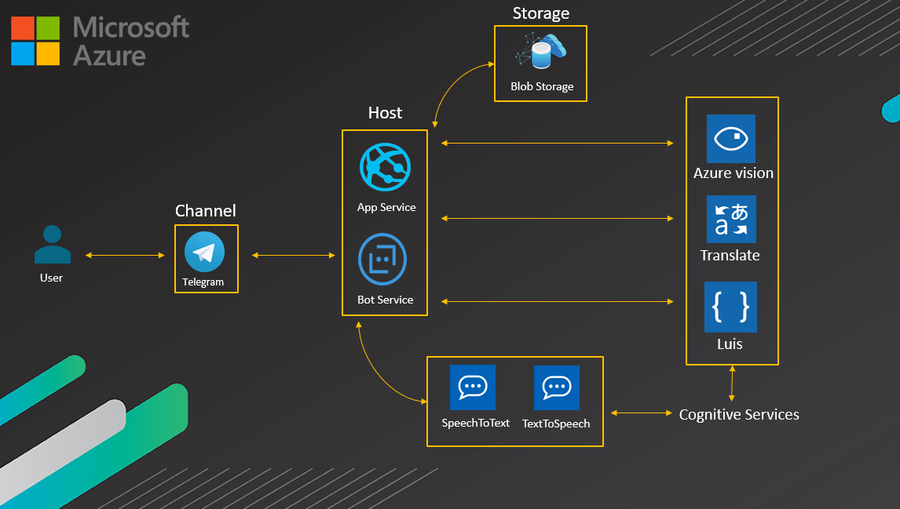

# HearForYou
**HearForYouBot** È un bot Telegram nato con lo scopo di rendere accessibile alcune funzionalità come la generazione di file audio a partire da file testuale e viceversa non supportate direttamente dalle principali app di messaggistica come WhatsApp e lo stesso Telegram a persone che non hanno la facoltà dell’udito e/o del parlato.

## Architettura

**Per una visione completa dei servzi utilizzati nell'implementazione del bot : 

